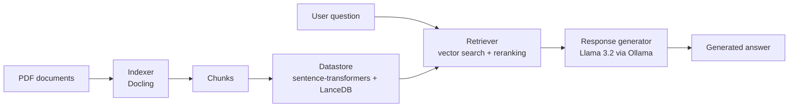

# RAG Pipeline

A modular Retrieval-Augmented Generation (RAG) pipeline that answers questions about a collection of PDF documents. (It runs **fully locally**).

## How it works



**Indexing**

1. The **indexer** converts each PDF into a structured document with Docling, then splits it into chunks along its sections.
2. Each chunk is prefixed with its section headings to keep its context.
3. The **datastore** embeds each chunk with a local model and stores it in LanceDB.

**Querying (run for every question)**

1. The **retriever** embeds the question and fetches the 30 closest chunks.
2. A reranking model keeps the 10 most relevant.
3. The **response generator** sends the question and chunks to the LLM, which answers only from that context.
   
## Tech stack

| Component | Tool |
|---|---|
| Document parsing & chunking | Docling |
| Embeddings | sentence-transformers, `all-MiniLM-L6-v2` (384 dimensions) |
| Vector database | LanceDB |
| Reranking | Cohere `rerank-v3.5` |
| LLM | Llama 3.2 via Ollama |
| CLI | argparse |

## Design

The pipeline is built around **abstract interfaces** (`src/interface/`) with concrete implementations in `src/impl/`. The `RAGPipeline` class only depends on the interfaces; `main.py` chooses which implementations to plug in.

This made it possible to replace OpenAI embeddings and LLM with local models by changing two files, without touching the rest of the pipeline.

All LLM calls go through a single function, `src/util/invoke_ai.py`, so switching models only requires editing that file.

## Project structure

```
RAG_Pipeline/
├── main.py                 # Entry point: builds the pipeline and runs CLI commands
├── src/
│   ├── rag_pipeline.py     # Orchestrates indexing, querying and evaluation
│   ├── interface/          # Abstract base classes (contracts)
│   ├── impl/               # Implementations
│   └── util/               # invoke_ai helper
├── sample_data/source/     # Sample PDFs
└── .env.example            # Required environment variables
```


## Acknowledgements

The base architecture follows the tutorial by pixegami.

**What I changed:**
- Imported my own sample data
- Replaced OpenAI embeddings with a local sentence-transformers model and adapted the schema to 384 dimensions.
- Replaced the OpenAI LLM with Llama 3.2 through Ollama, so the pipeline runs without paid APIs.
- Fixed a crash in the indexer when chunks have no headings.
- Fixed inconsistent imports across modules.
